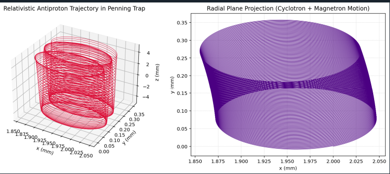

# Relativistic Antimatter Confinement & Annihilation Energy Modeling

[](https://opensource.org/licenses/MIT)
[](https://www.python.org/)

A Python-based computational physics framework investigating the theoretical feasibility of antimatter (specifically proton-antiproton, $p\bar{p}$) as an ultra-high energy density storage medium. The project couples 3D relativistic trajectory integration in electromagnetic traps with Monte Carlo branching ratio modeling of annihilation products.

---

## 🎯 Project Background & Motivation

# Antimatter Energy & Confinement Simulation

> **Note / Context:** *This independent side project was developed during my spare time out of pure curiosity, as an extension of an academic inquiry into antimatter as an ultimate energy storage concept.*

## Overview
 While the theoretical energy density of matter-antimatter annihilation ($2c^2 \approx 1.8 \times 10^{17}\text{ J/kg}$) exceeds chemical fuels by nine orders of magnitude, physical implementation faces two critical engineering bottlenecks:

1. **Confinement & Storage:** Charged antimatter (such as antiprotons) must be kept strictly isolated from baryonic matter using complex electromagnetic geometries to prevent premature annihilation.
2. **Energy Recovery Dynamics:** Annihilation does not directly yield thermal energy or pure electricity, but rather energetic pions ($\pi^\pm, \pi^0$) with relativistic kinetic energies, imposing strict limits on direct magnetohydrodynamic (MHD) recovery.

This repository provides a numerical workbench to simulate these two coupled domains in a reproducible, modular environment.

---

## ⚙️ Core Architecture & Physics

| Module | Physics & Numerical Methods | Key Output / Purpose |
| :--- | :--- | :--- |
| `penning_trap.py` | Relativistic Boris Pusher (Particle-in-Cell step) preserving phase-space volume. Computes trajectories inside a Penning-Malmberg trap with axial magnetic field $B_0$ and quadrupolar electrostatic field $V_0$. Accelerated with **Numba** (`@njit`). | Phase stability, cyclotron/magnetron orbital drift, non-neutral confinement tracking. |
| `annihilation.py` | Monte Carlo branching ratio generator based on empirical Poisson multiplicity distributions for charged ($\pi^\pm$) and neutral ($\pi^0$) pion cascades in low-energy $p\bar{p}$ annihilation. | Partitioning of usable kinetic MHD power vs. prompt gamma-ray unconfined radiative losses. |
| `main.py` | Simulation orchestration, statistical aggregation, and 3D / 2D phase-space visualization via `matplotlib`. | End-to-end execution and graphical trajectory analysis. |

---

## 📊 Key Results & Insights

* **Theoretical Specific Energy Density:** $\sim 1.80 \times 10^{17}\text{ J/kg}$.
* **MHD Direct Conversion Potential:** ~66.7% of total annihilation energy is channeled into charged pions ($\pi^\pm$), which can be guided and converted via magnetic field coils / MHD channels.
* **Radiative Losses:** ~ 33.3% of energy rapidly decays into unconfined, highly penetrating gamma rays (from $\pi^0 \to 2\gamma$), requiring heavy secondary radiation shielding.


### 📊 Simulation Analysis
* **Radial Confinement (XY Plane):** The projection clearly demonstrates the expected Penning trap dynamics. The antiproton exhibits a tight, high-frequency **cyclotron motion** superimposed on a slower, macroscopic **magnetron drift** ($\vec{E} \times \vec{B}$), ensuring perfectly stable radial confinement.
* **Axial Confinement (Z Axis):** The 3D trajectory confirms stable harmonic oscillation along the z-axis. The particle remains securely trapped within the electrostatic quadrupole potential well, bouncing between the turning points without escaping.
---

## 📁 Repository Structure

```text
.
├── Result/
│   ├── result             # Screenshot of the plot generated by main.py
├── src/
│   ├── annihilation.py    # Monte Carlo pion cascade & energy partitioning
│   └── penning_trap.py    # Relativistic Boris integrator & field definitions
├── main.py                # Simulation runner & Matplotlib visualizer
├── requirements.txt       # Project dependencies (NumPy, SciPy, Matplotlib, Numba)
└── README.md              # Project documentation
```

## Quick Start

```bash
# Clone the repository
git clone https://github.com/zoeweigel2005-ship-it/antimatter-energy-confinement.git
cd antimatter-energy-confinement

# Install dependencies
pip install -r requirements.txt

# Run simulation
python main.py
```
